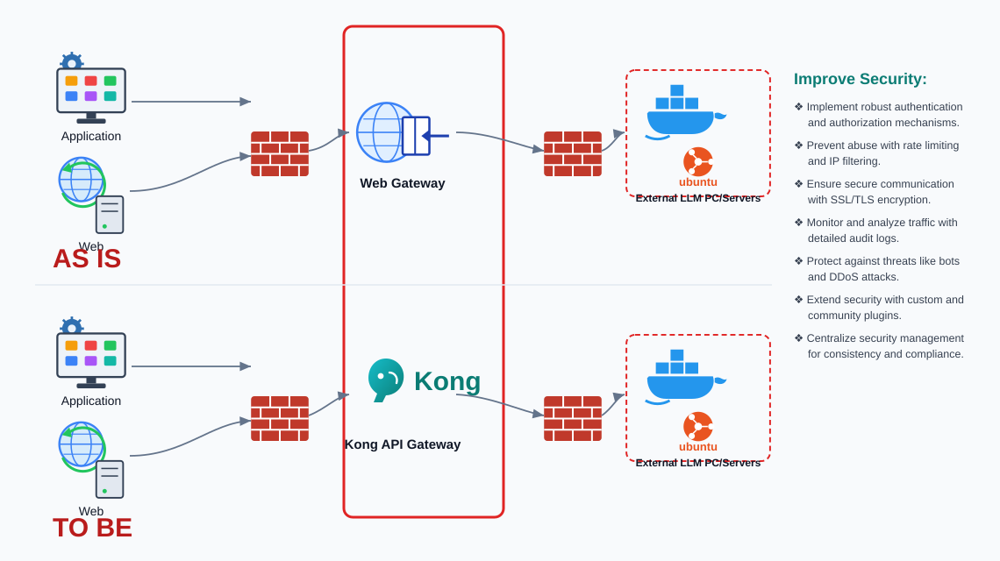

# SEHC AI Gateway — Overview

> **Product:** SEHC AI Gateway (Kong API Gateway OSS 3.9)
> **Version:** 1.0.3
> **Environment:** Air-gapped (PCA, no internet) · Docker stack
> **Purpose:** A single, secured entry point in front of all internal LLM servers.

---

## 1. What this is

The SEHC AI Gateway puts **Kong API Gateway** in front of the organization's
internal LLM machines (vLLM / Ollama on Ubuntu + Docker). Every application, web
service, and automation tool (n8n, Dify, Claude Code, internal apps) reaches the
models **through Kong** instead of calling each model server directly.

Kong becomes the **control plane** for:

- **Authentication & authorization** — who is allowed to call which model.
- **Traffic control** — rate limiting, IP filtering, timeouts for long LLM streams.
- **Encryption** — HTTPS/TLS termination at the edge.
- **Observability** — metrics and audit logs for every request.
- **Central management** — one place to add/remove apps, keys, and backends.

## 2. Why — the problem

Before the gateway, each internal application talked **directly** to an LLM server.
That meant:

- No consistent authentication — each server handled (or skipped) auth on its own.
- No rate limiting or abuse protection.
- No central place to rotate keys, restrict IPs, or add a new backend.
- No unified metrics or audit trail.
- TLS handled inconsistently per server.

## 3. AS IS → TO BE

| | AS IS | TO BE |
|---|---|---|
| Entry point | Generic Web Gateway | **Kong API Gateway** |
| Auth | Per-server, inconsistent | Centralized (API key + ACL) |
| Rate limit / IP filter | None | Per-service, managed |
| TLS | Per-server | Terminated at Kong (`:8443`) |
| Audit / metrics | Scattered / none | Central metrics + audit logs |
| Add a new app/backend | Touch each server | One command on the gateway |

## 4. Security goals (mapped to features)

| Security goal | How the gateway delivers it | Page |
|---|---|---|
| Robust authentication & authorization | `key-auth` + `acl` plugins (3-layer security) | [Security Model](02-security-model.md) |
| Prevent abuse (rate limit + IP filter) | `rate-limiting` + `ip-restriction` plugins | [Security Model](02-security-model.md) |
| Secure communication (SSL/TLS) | Proxy HTTPS on `:8443`, self-signed per-box cert | [Security Model](02-security-model.md) |
| Monitor & analyze traffic (audit logs) | Status API `/metrics`, Zabbix/Grafana, audit log | [Monitoring](06-monitoring.md) |
| Protect against bots / DDoS | Rate limiting (+ optional bot-detection plugin) | [Security Model](02-security-model.md) |
| Custom & community plugins | Kong plugin ecosystem (OSS) | [Architecture](01-architecture.md) |
| Centralized security management | `kong-manage.sh` admin tool + Kong Manager UI | [Management Tool](04-management-tool.md) |

## 5. Page map

1. **Overview** — this page.
2. **[Architecture](01-architecture.md)** — components, containers, ports, request path.
3. **[Security Model](02-security-model.md)** — the 3-layer security, TLS, admin RBAC, MFA, audit.
4. **[Deployment (air-gap)](03-deployment.md)** — offline bundle, `pca-deploy.sh`, upgrade/rollback.
5. **[Management Tool](04-management-tool.md)** — `kong-manage.sh` (18 operations).
6. **[Backup & Restore](05-backup-restore.md)** — export/restore the full config.
7. **[Monitoring](06-monitoring.md)** — metrics, Zabbix, Grafana, vLLM token usage.
8. **[Client Integration](07-client-integration.md)** — how apps connect (HTTP/HTTPS, cert trust).
9. **[Reference](08-reference.md)** — ports, endpoints, commands, storage layout.
