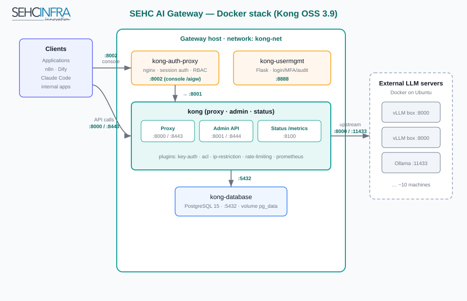

# Architecture

> How the SEHC AI Gateway is assembled: containers, ports, and the request path
> from a client application to an internal LLM server.

---

## 1. Component diagram



## 2. The Docker stack

The gateway runs as a Docker Compose stack (`docker-compose.yml`) on a single host.

| Container | Image | Role |
|---|---|---|
| `kong-database` | `postgres:15-alpine` | Kong's configuration DB (services, routes, consumers, plugins). Data in named volume `pg_data`. |
| `kong-bootstrap` | `kong:3.9` | One-shot `kong migrations bootstrap`; exits after DB schema is ready. |
| `kong` | `kong:3.9` | The gateway itself — proxy, Admin API, Admin GUI, Status API. |
| `kong-auth-proxy` | `nginx:alpine` | Session-auth reverse proxy in front of Kong Manager / Admin API; RBAC gate, CORS, `/aigw` rewrites, `/api/` access logging. |
| `kong-usermgmt` | `kong-usermgmt:latest` (custom Flask) | User management: login, roles, MFA, SMTP, lockouts, audit. |

All containers share the `kong-net` bridge network.

## 3. Ports

| Port | Service | Protocol | Exposure |
|---|---|---|---|
| `8000` | Kong **Proxy** | HTTP | Clients → models (plain HTTP; used by internal server-to-server) |
| `8443` | Kong **Proxy** | HTTPS | Clients → models (TLS, self-signed per-box cert) |
| `8001` | Kong **Admin API** | HTTP | Management (internal only — full control, keep restricted) |
| `8444` | Kong **Admin API** | HTTPS | Management over TLS |
| `8100` | Kong **Status API** | HTTP | Read-only `/status` + `/metrics` (Prometheus format) for scraping |
| `8002` | Kong **Manager GUI** | HTTP | Rebranded "SEHC AI GATEWAY" console (served behind `/aigw`) |
| `8888` | `kong-usermgmt` | HTTP | User-management API (Flask, container port 5000) |

> **Admin API (`8001`) exposes everything** — create/delete services, read keys.
> Only the **Status API (`8100`)** should be scraped by monitoring. Never point
> external tools at `8001`.

## 4. Admin console access path

- **Direct:** `http://<host>:8002/aigw/` — Kong Manager, rebranded.
- **Via IT Portal:** `http://<host>/aigw/*` — the Next.js IT Portal (`:80`) forwards
  to `:8002` (System Forward, `preserve_prefix=1`).
- The path prefix is **`/aigw`** (`KONG_ADMIN_GUI_PATH`); the IT Portal forward rule
  must match this prefix.

## 5. Request path (client → model)

```
Application / Web / n8n / Dify / Claude Code
        │  http(s)://<gateway>:8000|8443/<route>/v1/...
        ▼
   Kong Proxy  ──►  [ plugins: ip-restriction → key-auth → acl → rate-limiting ]
        │
        ▼  (upstream, per-route read/write timeout 600s)
   Internal LLM server (vLLM / Ollama, Docker on Ubuntu)
```

- The path prefix (e.g. `/coder`, `/ollaman8n`, `/vllmo4-dify`) selects the **route**,
  which maps to a **service** (the upstream URL of a specific model server).
- `strip_path=true` removes the prefix before forwarding, so the upstream sees a
  clean `/v1/chat/completions`.

## 6. Long-stream timeouts (LLM-specific)

LLM responses stream for a long time. Two timeout layers are raised well above the
60s defaults so Kong does not cut clients mid-stream:

- **HTTP level (all routes at once)** — set in `docker-compose.yml`:
  `KONG_NGINX_HTTP_SEND_TIMEOUT=600s`, `KONG_NGINX_HTTP_KEEPALIVE_TIMEOUT=620s`,
  `KONG_NGINX_HTTP_CLIENT_BODY_TIMEOUT=600s`.
- **Per-route upstream (Kong ↔ model)** — `connect_timeout=60000`,
  `read_timeout=600000`, `write_timeout=600000` (ms), set when the service is
  created (see the management tool).

## 7. Configuration store

Kong is in **DB-backed mode** (PostgreSQL). All services, routes, consumers,
credentials, and plugins live in the `kong` database and **persist across restarts**.
This is why backup/restore operates on the Kong config, and why enabling a plugin
once keeps it enabled.
