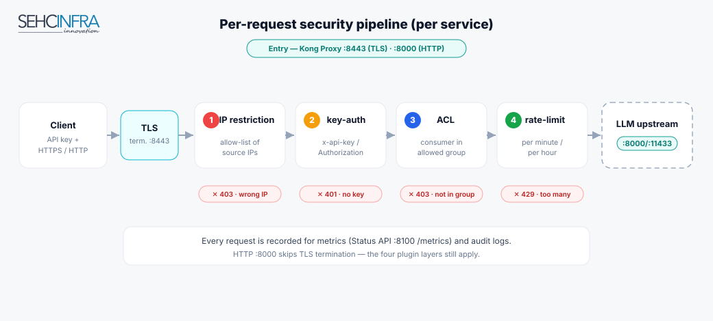

# Security Model

> The layered security applied to every request, plus the console-side controls
> (admin RBAC, MFA, lockouts, audit).

---

## 1. Request-path security (per service)

Each protected service enforces up to **three plugin layers**, in order:

| Layer | Plugin | What it does |
|---|---|---|
| 1 | `key-auth` | Requires a valid API key. The key is read from a header — `x-api-key` (n8n style) or `Authorization` (Dify / Bearer style). |
| 2 | `acl` | The caller's key must belong to a **consumer** in an allowed **ACL group**. This is the authorization boundary. |
| 3 | `ip-restriction` | (Optional) Only listed source IPs may reach the service. |

On top of these, a service can carry:

- `rate-limiting` — caps requests per minute / hour (abuse & basic DDoS mitigation).
- `bot-detection` (optional Kong plugin) — blocks known bad user-agents.

### How auth actually matches

- **Consumer** = an application identity (e.g. `n8n`, `dify_app`).
- **Credential** = a `key-auth` key stored **on the consumer** (global to the
  consumer, not per-service).
- **ACL group** = a label attached to a consumer; the `acl` plugin on a service
  allows one or more groups.

Because the key is bound to the consumer and the ACL group gates the service:

- Add a **new app** to an existing service → create a consumer + key in the same
  ACL group.
- Add a **new backend** for existing apps → create a service whose `acl` allows the
  existing group; the old keys work immediately.

> **Header format matters.** For `Authorization`/Bearer style, the stored credential
> is the **whole** header value (`Bearer <secret>`), and `key-auth`'s
> `config.key_names` is set to `Authorization`. For `x-api-key` style, the stored
> key is the raw secret and `config.key_names` is `x-api-key`. The management tool
> asks which style so it stays consistent.

## 2. Transport security (TLS)

- Kong Proxy serves **HTTPS on `:8443`** with a **self-signed certificate** whose
  **SAN matches the box IP** (IP clients send no SNI, so the default cert is used).
- **`:8000` stays plain HTTP** so existing internal server-to-server clients
  (e.g. n8n → Ollama) are unaffected.
- The certificate is **generated on the target box at deploy time**
  (`pca-deploy.sh` → `ensure_proxy_cert()`, air-gap safe via `openssl`).
  Use `--cert-ip <PCA_IP>` to set the SAN explicitly for production.
- Cert files live in a per-box, git-ignored `ssl/` directory and are **never shipped**
  in the release bundle.

> **Decision rule:** internal Dockerized services → use **HTTP `:8000`** (simplest,
> no cert trust). Only when HTTPS is required → trust the self-signed cert per
> runtime (see [Client Integration](07-client-integration.md)).

## 3. Console-side security (Kong Manager / Admin)

The admin console sits behind the `kong-auth-proxy` (nginx) + `kong-usermgmt` (Flask).

- **Login:** htpasswd-backed, with an HMAC-signed session cookie (`SESSION_MAX_AGE=1800`).
- **Admin-only console (v1.0.3):** Kong Manager **and** the Admin API (`/api/`) are
  restricted to `admin`-role accounts. A `user`-role account can authenticate but is
  **403 on all console surfaces** — closing a prior RBAC gap where non-admins could
  view keys/secrets through Kong Manager.
- **MFA via email:** per-user toggle (default off) with a global `MFA_ENFORCED`
  kill-switch for compliance lockdown. Code TTL 300s, max 3 attempts, 60s resend
  cooldown.
- **Lockouts:** password failures (5 / 15 min) and per-IP MFA failures (10 / 15 min).
- **Session revocation:** logout invalidates the cookie signature server-side.

## 4. Audit & retention

- Flask audit log: `data/audit/audit-YYYY-MM-DD.jsonl`.
- nginx `/api/` (Admin API) access log: `data/audit/access-current.jsonl`.
- Retention: `AUDIT_RETENTION_DAYS=90`.

## 5. Coverage vs. the security goals

| Goal | Status | Delivered by |
|---|---|---|
| Authentication & authorization | ✅ | `key-auth` + `acl` |
| Rate limiting + IP filtering | ✅ | `rate-limiting` + `ip-restriction` |
| SSL/TLS encryption | ✅ | Proxy HTTPS `:8443`, per-box cert |
| Audit logs | ✅ | Flask + nginx audit logs, 90-day retention |
| Bot / DDoS protection | ◑ | `rate-limiting` (baseline); `bot-detection` optional |
| Custom / community plugins | ✅ | Kong OSS plugin ecosystem |
| Centralized management | ✅ | `kong-manage.sh` + Kong Manager |
