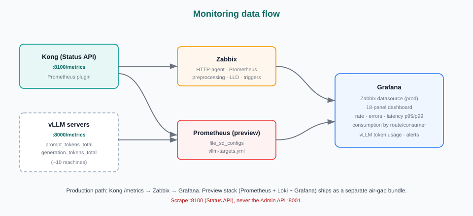

# Monitoring

> Metrics and logs for the gateway and the LLM servers behind it. Kong Manager OSS
> has no built-in analytics (Vitals is Enterprise-only), so observability is built
> from the free Prometheus plugin plus the existing Zabbix + Grafana stack.

---

## 1. Monitoring data flow



## 2. Gateway metrics (Prometheus plugin)

- The **Prometheus plugin** is enabled globally on deploy
  (`pca-deploy.sh → enable_prometheus_plugin()`); the plugin row persists in Postgres.
- Metrics are served by the **read-only Status API** at **`http://<PCA_IP>:8100/metrics`**
  (Prometheus text format). Scrape **this**, never the Admin API (`8001`).
- Metrics confirmed available:
  - `kong_http_requests_total{route,code}`
  - `kong_bandwidth_bytes{direction}`
  - `kong_kong_latency_ms_{sum,count}`, `kong_request_latency_ms_bucket`
  - `kong_datastore_reachable`

## 3. Zabbix + Grafana (the operator's stack)

The production observability path is **Zabbix + Grafana** (Grafana on the Zabbix
datasource), not Prometheus/Grafana:

```
Kong /metrics (:8100) ──► Zabbix HTTP-agent item (Prometheus preprocessing,
                            per-route LLD) ──► Grafana (Zabbix datasource)
```

- **Template:** `zabbix/template_kong_http.xml` (Zabbix 7.0) — HTTP-agent scrape with
  Prometheus pattern preprocessing, per-route Low-Level Discovery, and triggers
  (datastore down, metrics unreachable, high 5xx).
- Average latency = `_sum / _count` (Zabbix calculated item); request counters need
  "Change per second" for req/s.
- Wiring guide: `zabbix/README.md`.

## 4. DEV preview stack (Prometheus + Loki + Grafana)

For demos and local validation, a self-contained preview stack ships as its own
air-gapped bundle:

- `monitoring-preview/` — Prometheus + Loki + Grafana with an **18-panel dashboard**:
  health, request/error rates, latency (p95/p99), bandwidth, consumption breakdown
  and ranking by route / service / consumer, plus **error + audit log panels**
  (Loki + Promtail, scoped to the Kong stack).
- Build the bundle: `scripts/build-monitoring-bundle.sh` →
  `kong-monitoring-bundle-v*.tar.gz` (config + 6 Docker images + `deploy-monitoring.sh`).
- Preview ports: Grafana `3000`, Prometheus `9090`, Loki `3100`, mailpit `8026`
  (alert email viewer), webhook-sink `8081` (demo receiver).

## 5. Alerting

- Grafana-managed alert rules: **datastore down, Kong down, high 5xx**.
- Routed to a **single contact point** with **both email + webhook** integrations
  (verified end-to-end on DEV).
- Lesson learned: a webhook-only child route meant email never fired, and a webhook
  returning non-2xx aborted delivery — the fix was **one contact point with both
  integrations**.
- Zabbix side: template triggers exist; Email + Webhook media types and the trigger
  action are documented in `zabbix/README.md` (server-side config, not in the template).

## 6. vLLM token monitoring

Behind Kong are ~10 Ubuntu machines running vLLM. Goal: **token usage monitoring**
(not load balancing).

**Phase 1 (built on DEV):** scrape each vLLM's built-in `/metrics` **directly** with
Prometheus — no agent/exporter on the vLLM boxes, no Kong change.

- Metrics: `vllm:prompt_tokens_total`, `vllm:generation_tokens_total`
  (exposed by default unless vLLM is started with `--disable-log-stats`).
- `monitoring-preview/prometheus.yml`: job `vllm` via `file_sd_configs` →
  edit `vllm-targets.yml` to add/remove machines (auto-reloads ~30s).
- Dashboard `kong-overview` has a **"vLLM Token Usage"** section (token rate by
  model/machine + range tables).
- **PCA prerequisites:** vLLM must listen on `0.0.0.0:8000` (not `127.0.0.1`), and
  the firewall must allow the Prometheus host to reach tcp/8000 — restrict that port
  to the Prometheus IP since it also serves the model API. Guide:
  `monitoring-preview/VLLM-TOKENS.md`.

**Phase 2 (not started):** per-**consumer** token attribution needs Kong AI Gateway
(`ai-proxy` plugin + Prometheus `ai_metrics: true` → `ai_llm_tokens_total{consumer}`).
The `consumer` label requires **Kong 3.11+** (PCA runs 3.9), so this is a separate
upgrade + route-migration project.
