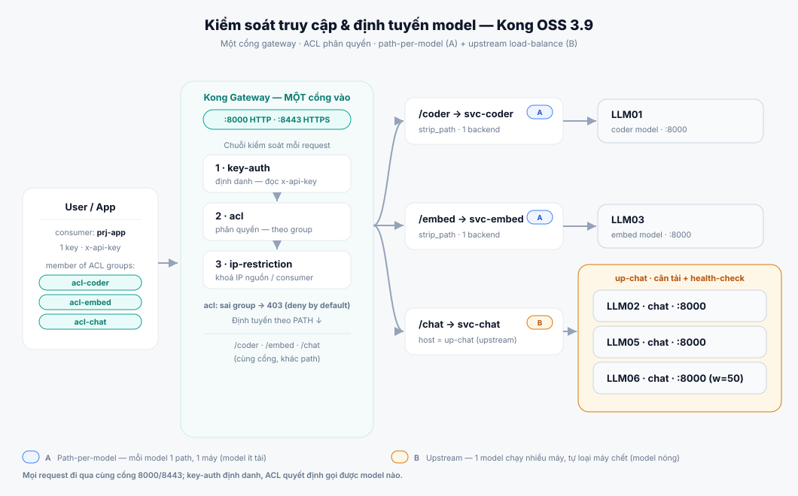

# Model Portal — Web GUI

> A single-page admin web UI for the gateway, served at **`/kongportal`** behind
> the same admin login as the console. It manages the whole Kong object model
> (services, routes, consumers, plugins, upstreams) plus usage, request and audit
> views — the visual counterpart of `kong-manage.sh`. Styled to match the
> SEHC **IT Portal** design system.

---

## 1. Access

| How | URL |
|---|---|
| Direct (HTTPS) | `https://<box>:8452/kongportal` |
| Via IT Portal forward | `https://<box>/aigw/kongportal` |

- **Admin-only.** The portal sits behind the same `_auth_check_admin` gate as the
  console: anonymous users are redirected to `/auth/login`, non-admins get a 403.
  Its API calls reuse the authenticated `/api` Admin proxy — no new auth surface.
- Switch links connect the portal and **Kong Manager** both ways.
- All portal reads/writes go through the admin session; nothing is exposed
  unauthenticated.

## 2. The 3-axis convention

The portal is opinionated around a naming convention so the gateway stays legible:

| Axis | Object | Naming |
|---|---|---|
| **Model** = capability | Service + Route | `svc-<slug>`, path `/<slug>`, ACL group `acl-<slug>` |
| **Server** | Kong tags on the service | `box:<host>`, `cap:<slug>`, `model:<name>` |
| **Project** = client | Consumer | `prj-<name>` + its own token + optional IP allow-list |

A project (consumer) is granted access to a model by being added to that model's
**ACL group**. This is many-to-many: one model → many projects, one project →
many models. Routes belong to exactly one service (one-to-many).

> Legacy / non-convention objects are **not hidden** — the Models list shows every
> service with a `managed` / `legacy` badge, and the Consumers tab lists every
> consumer.

## 3. Tabs

| Tab | Purpose |
|---|---|
| **Overview** | Health strip (Kong version, DB, connections, upstream health, **stray global-auth warning**), counts, a Model ↔ Project access matrix, and the client-access URL per model. |
| **Topology** | The **whole map** — every service with its routes, plugins (name + instance name), ACL groups, **client-access URLs**, and the consumers that can call it (via which group, **API key**, allowed IPs). **Everything is editable inline**: add/edit/delete services, routes, plugins, ACL-group allow-lists and memberships. Live filter. See §4. |
| **Wizard** | Guided setup — create a model, its route, **init plugins**, and a project in one flow (see §7). |
| **Models** | Register a model (service + route + key-auth + acl + tags, with optional **init plugins**); edit backend / route; delete (cascades routes + plugins); **Make managed** on any un-secured service. Shows all services (managed + legacy). Each plugin in the Security column is **clickable** — it jumps to the Plugins tab, selects the service and opens that plugin's editor. |
| **Routes** | List / add / edit / delete routes — many per service (paths, methods, hosts, strip_path). A **Plugins** button per route opens the Plugins tab for that route's model to manage the plugins that apply to it. |
| **Consumers** | Add any consumer (incl. legacy), manage ACL group membership, and **issue / reveal / delete API keys**; edit username, tags, and **Allowed IPs** (ip-restriction — blank removes it). Replaces the old Projects tab; create with a token + models via the **Wizard**, manage membership in **Access (ACL)**. An **ACL groups → members** table shows which consumers each group contains. **Convert to project** renames a legacy consumer to `prj-*` (keys / ACL / IP are kept — they bind to the id) so it shows up as a Project. |
| **Access (ACL)** | Central access-control management + **audit**. Each group with the services that allow it and its member projects; add/remove **members** and service **allow-lists** inline (× on any chip revokes). The audit panel flags open (no-ACL) services, services missing key-auth, empty allow-lists, and stray **global** auth plugins. |
| **Upstreams** | Load-balancing pools — create an upstream, add backend targets (host:port + weight), watch target health. |
| **Usage** | Per-consumer traffic **broken down by model** (requests, 5xx, in/out bandwidth). A **Period** selector — *All-time · Today · Yesterday · Last 7 days*: **All-time** uses the live Prometheus counters (cumulative since Kong restart); the **dated ranges** are computed from the request log (`started_at` + request/response sizes) and cover the retained log (~10 MB rolling). **Group by consumer** (default) rolls all of a consumer's models into one row with a per-model breakdown; untick for the flat consumer×model view. CSV export. A **Grafana ↗** link (also a sidebar **Grafana** entry) opens the historical per-consumer dashboard (`http://<gateway>:3000/d/kong-overview`; override with `localStorage['grafana_url']`). |
| **Requests** | Recent requests with **source IP**, consumer, model, **path** and status (access log). Filter by **Denied (4xx)** / **Errors (5xx)**; each blocked row shows a **"Why blocked"** hint (401 = key-auth; 403 = ACL **or** IP restriction — compare the Source IP with the consumer's Allowed IPs; 5xx = upstream unreachable). The Source IP shown is what Kong actually sees (often a Docker/NAT address, not the client's LAN IP) — use it to fix `ip-restriction` allow-lists. CSV export. |
| **Test** | Send a real request through Kong with a project's key — see status / latency / body (key-auth, ACL and routing all apply). |
| **Audit** | Admin change log — who created / edited / deleted what, from which IP. |
| **Plugins** | Two-column plugin manager for **any** service (managed or legacy). **Active** (left) lists the plugins currently applied — each with its config summary, on/off and **Edit** (schema-driven form, no JSON) and delete. **Add protection** (right) offers the curated plugins not yet on the model (key-auth, acl, ip-restriction, rate-limiting, request-size-limiting, bot-detection, cors) as one-click **Add** with sensible defaults, plus an **any Kong plugin** picker. New plugins are auto-named. |
| **Backup** | Export the whole gateway config to JSON; restore it from a file (idempotent upsert by id, never deletes). |
| **Users** | Portal / admin **login accounts**, folded into the portal (was a separate `/users/` page): add / delete users, promote / demote role, reset password, set email, toggle per-user MFA, and edit **SMTP** settings (host / port / auth / from / TLS) with a test-send. Calls the usermgmt app under `/users/api` with the same session; admin-only. |

Tables on Models / Routes / Consumers / Projects / Topology have a quick client-side filter.

## 4. Topology & client-access URLs

The **Topology** tab is the single holistic map. Each service is one card showing:

- **Routes** — its paths (and methods).
- **Plugins** — each by **instance name** (with the plugin type as a sub-tag) and a
  short config summary (e.g. `acl → acl-embed`, `key-auth [x-api-key]`), so multiple
  plugins are easy to tell apart.
- **ACL groups** — the groups the service allows (or "open (no acl)").
- **Client access** — the exact URL a client calls, in both schemes:
  `http://<gateway>:8000<path>` and `https://<gateway>:8443<path>`. `<gateway>` is
  the host you opened the portal on (so on PCA it reads the PCA IP). **Click a URL
  to copy.** A service with no route shows "not reachable".
- **Consumers that can call this** — each reachable consumer, the group it comes in
  via, its **API key** (masked, with a reveal eye + click-to-copy) and allowed IPs.

> Three different URLs per service: **client access** (`https://<gw>:8443/embed`, what
> callers use) vs **backend** (`http://<vllm>:8001`, the real upstream) vs **route
> path** (`/embed`). The Overview "Models" table also shows the client-access URLs.

## 5. Access control model & scaling

Access is controlled by **two plugins working together**: `key-auth` identifies the
caller (API key → a **consumer**), then `acl` authorises it — the consumer must
belong to a group the model allows, otherwise Kong returns **403** (deny by
default). Identity and authorisation are inseparable: without key-auth there is no
consumer for acl to check.

The relationship is **many-to-many** and lives entirely in ACL groups: a consumer
joins several groups (calls several models), and a group has several members (a
model reached by several users). The **Consumers** tab shows both directions — the
per-consumer group list, and an **"ACL groups → members"** table (the inverse:
which consumers each group contains).

**One gateway port, many models (path-per-model).** Every model is its own service
on a shared port (`:8000` / `:8443`); the **path** selects the model (`/coder`,
`/embed`, `/chat`). One consumer with one key, joined to several ACL groups,
reaches several models — each backed by a different machine — all through the same
port. On Kong OSS the request body's `model` field does **not** pick a backend; the
path does.

**One model, many machines (upstream load-balancing).** For a hot model, put
several identical backends behind an **Upstream**: create it in the **Upstreams**
tab, add each machine as a target (`host:port` + weight), then set the model's
backend to the upstream name instead of a single URL. Kong balances across targets
and drops unhealthy ones (active health-check on e.g. vLLM `/health`). All targets
in one upstream must serve the **same** model. Mix both: light models one machine
(path-per-model), a busy model behind an upstream.

## 6. Legacy vs managed, and "Make managed"

**Managed** objects follow the convention (`svc-<slug>` with `acl-<slug>`,
`prj-<name>`); **legacy** objects are pre-existing / ad-hoc config (e.g. a service
named `1`, a consumer `n8n`). They are badged accordingly and **never hidden**.

Management is almost identical for both — edit, delete, routes, plugins (with
instance names), consumers, ACL, keys, Test, Topology, Backup all work on **any**
configured object. The only differences:

- **Creation** is convention-only: Register / Wizard produce `svc-`/`prj-` objects.
  Legacy objects are inherited as-is.
- **Granting a project** needs the service to have an **ACL group**. For managed
  models it's `acl-<slug>`; for legacy the portal reads the service's **real** acl
  group. A legacy service with **no ACL** (open — any valid key works) is flagged in
  the **Access (ACL)** audit until you give it one (add a group there or via the
  Wizard).
- **Overview** is the convention summary; the **Topology** tab is the all-objects
  view.

**Make managed** (Models tab): any service missing key-auth or acl shows a one-click
**Make managed** button — it adds **key-auth** (you pick the header) and an **acl**
group (`acl-<name>`), turning an open/legacy service into an access-controlled one.
After that it behaves exactly like a model (projects can be granted, consumers show
in Topology, etc.). Fully-secured services don't show the button.

## 7. Setup Wizard

A 4-step guided flow (**Model → Route → Project → Review**) with three modes in
step 1:

- **Create a new model** — provisions `svc-<slug>` (+ key-auth + `acl-<slug>`),
  its route, and a `prj-<name>` project (token + ACL membership + optional IP
  restriction). Guards against an already-existing slug so it never overwrites a
  model.
- **Use an existing model** — pick a model that already exists (managed or legacy);
  the wizard skips service/route creation, auto-detects that model's ACL group, key
  header and route, and just adds a **new project** to it.
- **Add a project to existing ACL group(s)** — onboard a new project and grant it
  access to one or more **existing** ACL groups (tick a multi-select, pick the key
  header). No model or route is created; the consumer is created, keyed, joined to
  every ticked group, and optionally IP-restricted. This is the guided way to give a
  new user access to several existing models at once.

In new-model mode the Route step also has an optional **"Init plugins"** picker —
add plugins (each with an optional instance name) to the new service, on top of the
automatic key-auth + acl. The review step summarises everything before it is
created; the result links to the **Test** tab.

## 8. Plugin config — schema-driven forms & instance names

Adding or editing a plugin renders a form generated from the plugin's real Kong
schema (`GET /schemas/plugins/<name>`): each config field becomes a typed input
(number / text / checkbox / select / comma-list), prefilled with defaults or the
current value. Filling the fields builds and submits the config automatically —
there is no raw-JSON step.

Each plugin can be given an **instance name** (Kong `instance_name`) when added or
edited — including the **core** key-auth / acl rows, which now have an **Edit**
button. The Plugins tab and Topology show the instance name as the primary label
(with the plugin type as a sub-tag), so multiple plugins of the same type are easy
to tell apart. The Plugins model picker lists **all** services (managed + legacy).

**Auto-naming on create** — any plugin created through the portal (Register Model,
Wizard, Plugins tab, Topology, ACL/consumer flows) is automatically given an
instance name following the scheme `<plugin>-<scope>` unless you typed one, so a
plugin is **never created unnamed**. Examples: `key-auth-svc-coder`,
`acl-svc-coder`, `ip-restriction-con-prj-app`. Explicit names always win.

**Auto-name plugins** (button in the Plugins tab header) does the same for
**existing** plugins that have no instance name — useful for plugins created
outside the portal (Kong Manager / Admin API). It previews the plan and skips
already-named plugins. Every plugin also shows a **friendly type label** so its
kind is clear without knowing Kong's shorthand — e.g. `key-auth` → **API Key**,
`acl` → **ACL (authorization)**, `ip-restriction` → **IP Restriction**,
`rate-limiting` → **Rate Limit** (the raw Kong name stays visible alongside).
Hovering any plugin (Plugins tab, Topology, Models) shows a plain description of
what it does.

## 9. Health & safety warnings

The Overview health strip flags a **stray GLOBAL auth plugin** (`basic-auth`,
`key-auth`, `jwt`, `oauth2`, `hmac-auth`, `ldap-auth`, `mtls-auth`). Such a plugin
applies to **every** route and, combined with per-service key-auth, will **401
all API-key traffic**. Remove it in the Plugins tab unless it is intentional.

## 10. How auth actually resolves (for the Test tab)

A request through the proxy (`:8000` / `:8443`) is evaluated as:

| Case | Result |
|---|---|
| No API key | **401** — "No API key found in request" |
| Wrong key | **401** — "Unauthorized" |
| Valid key, ACL allows the model | passes → upstream (**200**, or 502 if the backend is unreachable) |
| Valid key, ACL does **not** allow the model | **403** — "You cannot consume this service" |

The Test tab reproduces exactly this by proxying through the real Kong pipeline
(admin-gated `/modeltest/` → `:8000`).

## 11. Backup / restore

- **Export** downloads a JSON snapshot of services, routes, plugins, consumers,
  ACLs, API keys, upstreams and targets. It contains **API keys in clear text** —
  store it securely.
- **Restore** upserts every entity by id (idempotent — updates existing,
  recreates missing) and never deletes. Use a backup taken from a healthy config.

## 12. Deployment

The portal ships inside the standard PCA bundle. `pca-deploy.sh` mounts the
`portal/` directory into the auth-proxy, serves `/kongportal` behind the admin
gate over HTTPS (`:8452`), and enables the supporting plugins
(**Prometheus** for Usage, **file-log** for Requests, with logrotate). No schema
or data migration is involved — it is UI over the existing Admin API.

## 13. Troubleshooting

| Symptom | Cause / fix |
|---|---|
| Every request 401s despite valid keys | A stray **global auth plugin** (e.g. `basic-auth`) — the Overview health strip flags it; delete it in Plugins. |
| Can't grant a project to a legacy service | It has no ACL group (it's open). Use **Make managed** in the Models tab (or add key-auth + acl in Plugins) first. |
| Client-access URL shows `localhost` | It reflects the host you opened the portal on. Open the portal via the PCA IP/hostname and the URLs read that host. |
| Model created but 401 on the header | Project created with the wrong key header. OpenAI-compatible clients send `Authorization: Bearer` — create the project with the *Authorization* header (Wizard / Projects), or set the model's key-auth `key_names` accordingly. |
| Test tab hangs / 502 | The model's backend is unreachable from Kong (expected on DEV where vLLM boxes aren't routable). |
| Pre-existing config "missing" | It is shown — tick **Show all** on Models, or look in the Consumers tab; nothing is deleted. |
| Real client IP shows the proxy | Behind an L4 proxy, set Kong `trusted_ips` + `real_ip_header=X-Forwarded-For`. |
